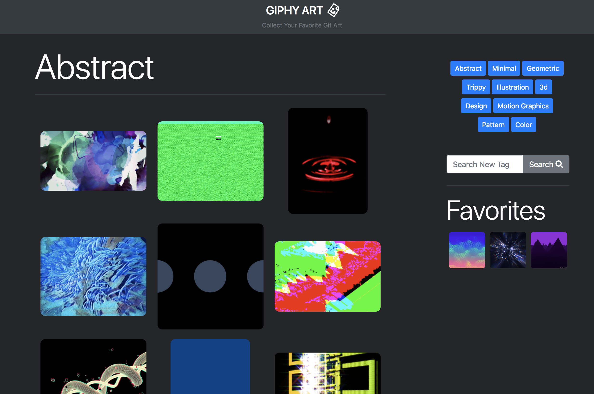
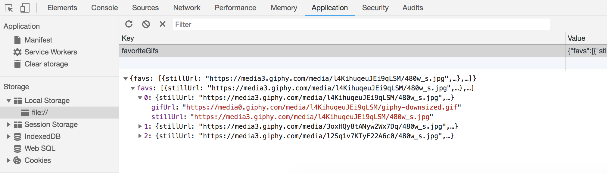

# Giphy Art
---

Giphy Art allows you to randomly search through Giphy for various art styles and even allows you to search for your own style. When you find a gif that you love hit the start icon on the lower right of the gif to add it to your favorites.

[Live Site](https://acekreations.github.io/Giphy-Art/)

## Technology Used
---
- HTML
- CSS / Bootstrap
- JavaScript / JQuery
- [Giphy API](https://developers.giphy.com/)

## Challenges
---

This was the first time I have worked with localStorage, although setting and getting my stored data was simple, figuring out the best way to store a users favorite gifs proved a bit tricky. I ultimately settled on storing one key/value pair with an array of objects that contained the necessary urls to retrieve the users gifs.

## Author
Craig Melville
